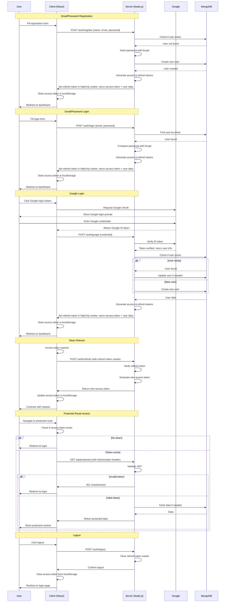

# Authentication Flow Diagram

```mermaid
sequenceDiagram
    participant U as User
    participant C as Client (React)
    participant S as Server (Node.js)
    participant G as Google
    participant M as MongoDB

    Note over U,S: Email/Password Registration
    U->>C: Fill registration form
    C->>S: POST /auth/register {name, email, password}
    S->>M: Check if user exists
    M-->>S: User not found
    S->>S: Hash password with bcrypt
    S->>M: Create new user
    M-->>S: User created
    S->>S: Generate access & refresh tokens
    S->>C: Set refresh token in httpOnly cookie, return access token + user data
    C->>C: Store access token in localStorage
    C->>U: Redirect to dashboard

    Note over U,S: Email/Password Login
    U->>C: Fill login form
    C->>S: POST /auth/login {email, password}
    S->>M: Find user by email
    M-->>S: User found
    S->>S: Compare password with bcrypt
    S->>S: Generate access & refresh tokens
    S->>C: Set refresh token in httpOnly cookie, return access token + user data
    C->>C: Store access token in localStorage
    C->>U: Redirect to dashboard

    Note over U,S: Google Login
    U->>C: Click Google login button
    C->>G: Request Google OAuth
    G-->>U: Show Google login prompt
    U->>G: Enter Google credentials
    G-->>C: Return Google ID token
    C->>S: POST /auth/google {credential}
    S->>G: Verify ID token
    G-->>S: Token verified, return user info
    S->>M: Check if user exists
    alt User exists
        M-->>S: User found
        S->>M: Update user if needed
    else New user
        S->>M: Create new user
    end
    M-->>S: User data
    S->>S: Generate access & refresh tokens
    S->>C: Set refresh token in httpOnly cookie, return access token + user data
    C->>C: Store access token in localStorage
    C->>U: Redirect to dashboard

    Note over U,S: Token Refresh
    C->>C: Access token expired
    C->>S: POST /auth/refresh (with refresh token cookie)
    S->>S: Verify refresh token
    S->>S: Generate new access token
    S->>C: Return new access token
    C->>C: Update access token in localStorage
    C->>U: Continue with request

    Note over U,S: Protected Route Access
    U->>C: Navigate to protected route
    C->>C: Check if access token exists
    alt No token
        C->>U: Redirect to login
    else Token exists
        C->>S: GET /api/protected (with Authorization header)
        S->>S: Validate JWT
        alt Invalid token
            S->>C: 401 Unauthorized
            C->>U: Redirect to login
        else Valid token
            S->>M: Fetch data if needed
            M-->>S: Data
            S->>C: Return protected data
            C->>U: Show protected content
        end
    end

    Note over U,S: Logout
    U->>C: Click logout
    C->>S: POST /auth/logout
    S->>S: Clear refresh token cookie
    S->>C: Confirm logout
    C->>C: Clear access token from localStorage
    C->>U: Redirect to login page
```